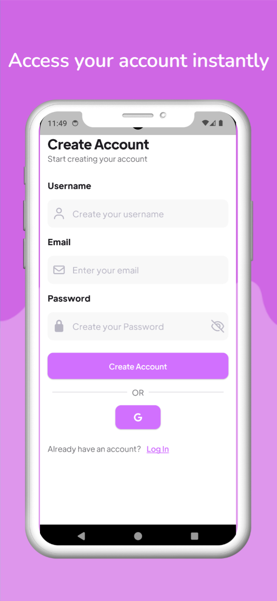
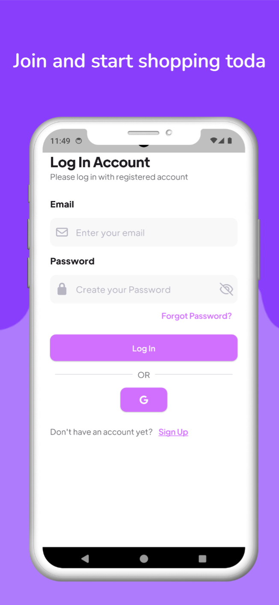
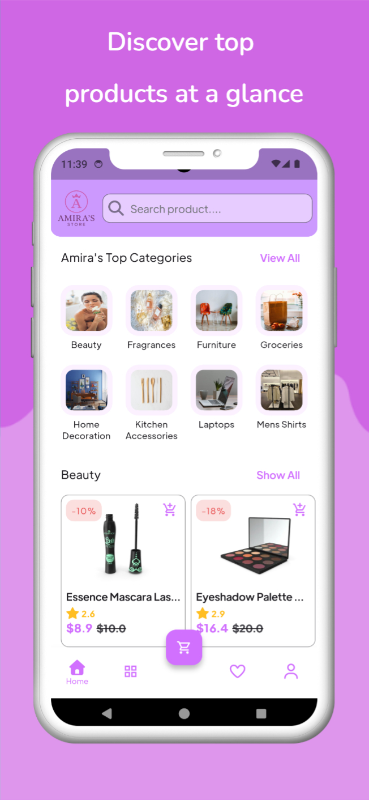
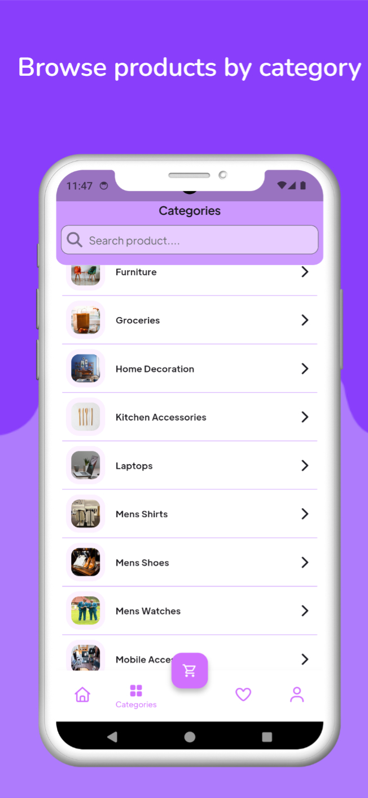

## 📬 Contact Me

- ✉️ Email: [amira20nasser@gmail.com](mailto:amira20nasser@gmail.com)  
- 🔗 LinkedIn: [Amira Nasser](https://www.linkedin.com/in/amira-nasser-sayed/)

# 🛍️ Amira's Store App

**Amira's Store** is a modern e-commerce mobile application built with **Flutter** following the **Clean Architecture** principles.  
It provides users with a smooth shopping experience, allowing them to explore product categories, view detailed product information, and manage their cart seamlessly.

---

## 📸 Screenshots

  
  
  
  
  
    
      

---

## 🚀 Features
- 🔑 Authentication – Secure Firebase Authentication [DONE]
    - Email & Password Signup – Users receive a verification email after signing up [DONE]
    - Phone Number Verification – SMS verification code for secure login [DONE]
    - Option to resend verification email or SMS code if not received [DONE]
- 🏠 Home Screen – Displays top categories and featured products [DONE]
- 📂 Category Browsing – Explore products by category without redundant API calls [Done]
- 🧾 Product Details – View detailed descriptions, prices, and discounts [Not Yet]
- ❤️ Favorites Management – Add or remove products from your wishlist [Not Yet]
- 🛒 Cart Management – Add products to the cart and review before checkout [Not Yet]
- 🔍 Search Functionality – Quickly find products by name [Not Yet]
  <!-- 🌐 Real-time Updates – Sync with Firebase for dynamic content updates-->
<!-- 💾 Offline Support – Cached data using Hive for a smoother offline experience-->
---

## 🧱 Architecture

This project follows **Clean Architecture** and **Cubit** state management to ensure scalability and maintainability.

### Project Layers:
- **Presentation Layer** – UI and Cubits (using `flutter_bloc`)
- **Domain Layer** – Business logic and entities
- **Data Layer** – Repositories, models, and data sources (Remote + local)

---

## 🛠️ Technologies Used

| Category | Technology |
|-----------|-------------|
| Framework | Flutter |
| Architecture | Clean Architecture |
| State Management | Cubit (Bloc) |
| API Handling | DIO |
| Backend | Firebase |
| Local Storage | Hive |
| Dependency Injection | GetIt |
| Design | Material 3 |

---
