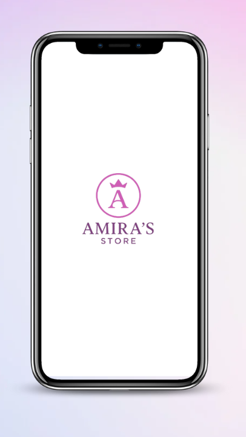
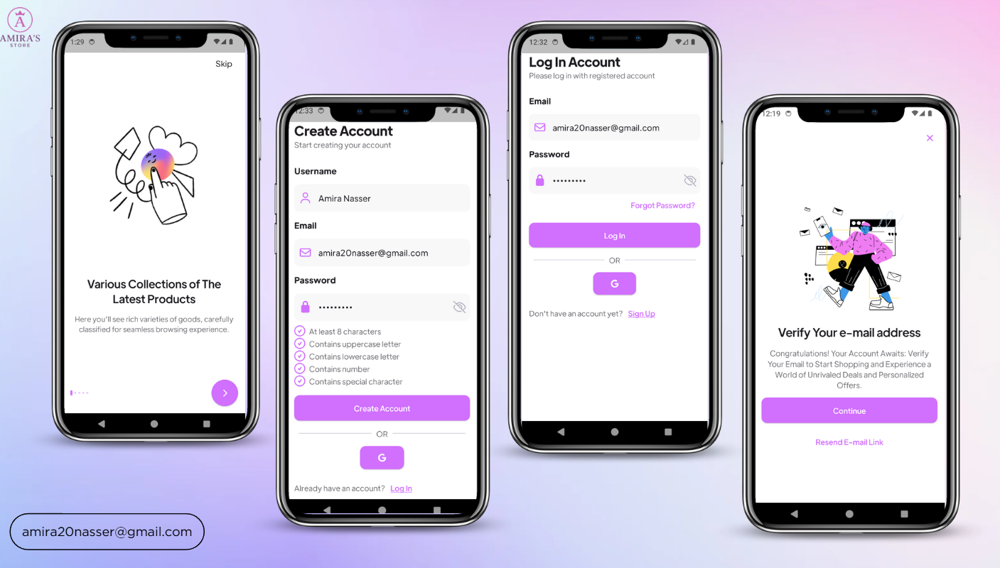
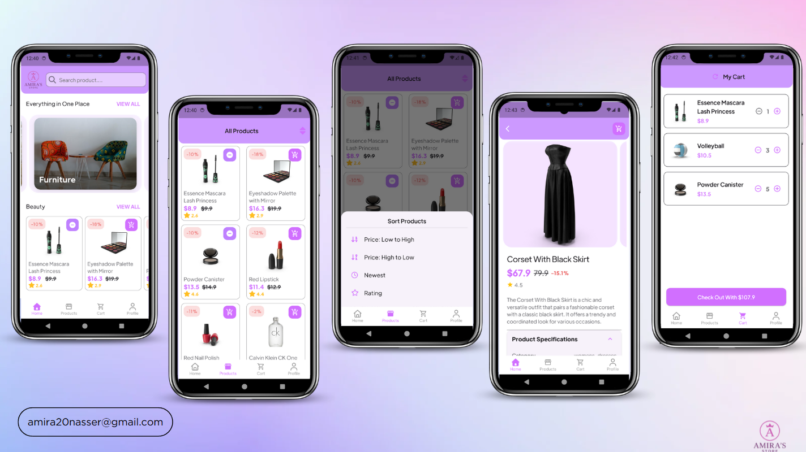
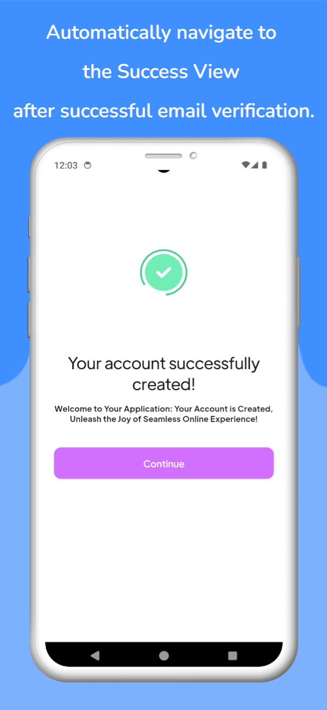
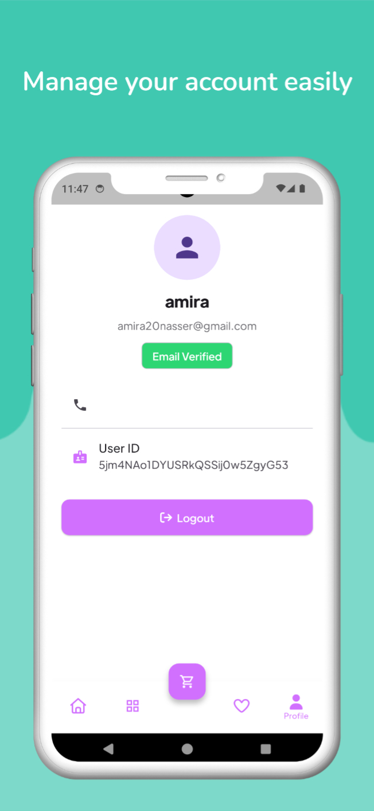

## 📬 Contact

- ✉️ **Email:** [amira20nasser@gmail.com](mailto:amira20nasser@gmail.com)  
- 🔗 **LinkedIn:** [Amira Nasser](https://www.linkedin.com/in/amira-nasser-sayed/)

---

# 🛍️ Amira’s Store App

**Amira’s Store** is a modern **e-commerce mobile application** built with **Flutter**, following the principles of **Clean Architecture**.  
It provides a smooth and user-friendly shopping experience, enabling users to browse categories, explore product details, and manage their cart seamlessly.

---

## 📸 Screenshots

  

  

  

  
  

---

## 🚀 Features

- 🔑 **Authentication** – Secure Firebase Authentication  
  - **Email & Password Signup:** Users receive a verification email after registration  
  - **Phone Number Verification:** Secure login using an SMS verification code  
  - **Resend Options:** Ability to resend verification emails or SMS codes  

- 🏠 **Home Screen** – Displays top categories and featured products  
- 📂 **Category Browsing** – Explore and filter products by category  
- 🧾 **Product Details** – View comprehensive product information, including descriptions, prices, and discounts *(Coming Soon)*  
- 🛒 **Cart Management** – Add products to the cart and review before checkout  
  - Supports **offline synchronization**:  
    - Add items to the cart while offline  
    - Automatic synchronization with Firestore once reconnected  
    - Reflects updates across all logged-in devices  

- 🔍 **Search Functionality** – Quickly find products by name 
- **Dark & Light Theme**
<!-- 🌐 **Real-Time Updates** – Firebase-powered dynamic content *(Planned)* -->
<!-- 💾 **Offline Support** – Cached data for a smoother offline experience *(Planned)* -->

---

## 🧱 Architecture

This project follows **Clean Architecture** principles and uses **Cubit** for state management to ensure scalability, maintainability, and separation of concerns.

### Layered Architecture

- **Presentation Layer** – UI components and Cubits (using `flutter_bloc`)  
- **Domain Layer** – Core business logic and entity definitions  
- **Data Layer** – Repositories, models, and data sources (Remote + Local)

---

## 🛠️ Technologies Used

| Category | Technology |
|-----------|-------------|
| **Framework** | Flutter |
| **Architecture** | Clean Architecture |
| **State Management** | Cubit (Bloc) |
| **API Handling** | DIO |
| **Backend** | Firebase |
| **Local Storage** | Hive |
| **Dependency Injection** | GetIt |
| **Design System** | Material 3 |

---

## 🌱 Future Enhancements
Here are some planned improvements for upcoming versions of Amira’s Store:
- 💳 Payment Integration – Add support for Stripe and PayPal
- 🌐 Multi-language Support – English and Arabic interface options
- 📈 Admin Dashboard – Manage products, categories, and user analytics